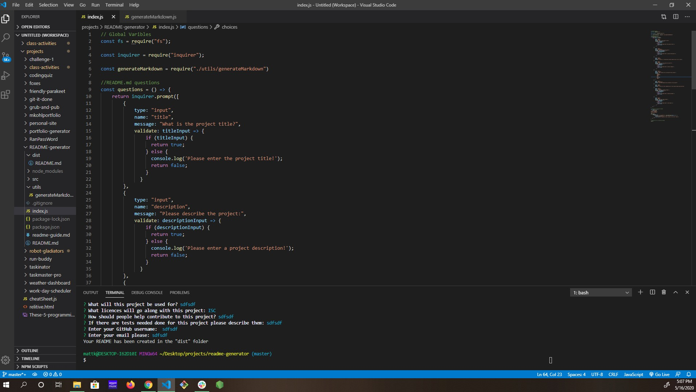

# README Generator


## Table of Contents
- [Description](#description)
- [Installation](#install)
- [Usage](#usage)
- [Licences](#licences)
- [Contribution](#contribution)
- [Tests](#tests)
- [Questions](#questions)

## Description
### This node.js application will help you create a professional README for your projects.

## Install
```
npm install inqurier
```


          
## Usage
### This will be used for some who is looking for a quick and easy way to make professional README's
          
## Licences
  
This project is licenced under Mozilla
        
## Contribution
### You can help by cloning and adding some flair to the README being generated.
          
## Tests
### Not at this time.

## Questions
### [Mattkohl82 for GitHub](https://github.com/Mattkohl82)  
### mattkohl82@gmail.com for ✉️ email


## The above README was created using this README generator  

### Below is a link to the GitHub repository   
[README Generator Repo](https://github.com/mattkohl82/README-generator)  

### Below is a link to a video of me demostrating the application  
[Click Here Please](https://github.com/mattkohl82/README-generator/blob/master/src/videopreview.webm)  
[Youtube version](https://youtu.be/sA2iutzGDfE)


### Belowe are two screen shots of the code  

 
